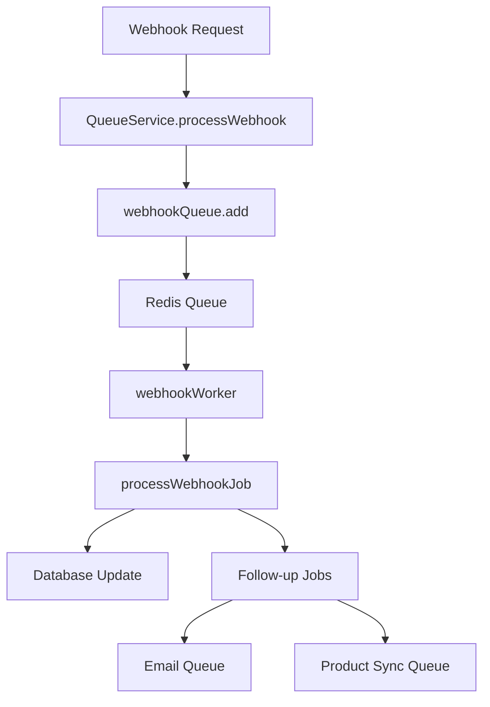

# BullMQ Implementation Guide 🚀

This guide explains the complete BullMQ implementation for your Shopify webhook project, providing scalable, maintainable, and reliable background job processing.

## 📋 Table of Contents

1. [Overview](#overview)
2. [File Structure](#file-structure)
3. [How It Works](#how-it-works)
4. [Installation](#installation)
5. [Configuration](#configuration)
6. [Usage Examples](#usage-examples)
7. [Monitoring & Management](#monitoring--management)
8. [Best Practices](#best-practices)
9. [Troubleshooting](#troubleshooting)

## 🎯 Overview

### What is BullMQ?

BullMQ is a Redis-based queue system that allows you to:
- **Process tasks asynchronously** (emails, webhooks, data processing)
- **Handle high loads** without blocking your main application
- **Retry failed jobs** automatically with exponential backoff
- **Schedule jobs** for future execution
- **Scale horizontally** by adding more worker processes
- **Monitor job progress** and statistics in real-time

### Why Use BullMQ in Your Project?

**Before BullMQ (Synchronous):**
```
Webhook Request → Process Order → Send Email → Update Inventory → Response (5+ seconds)
                 ↑ If any step fails, everything fails
```

**After BullMQ (Asynchronous):**
```
Webhook Request → Queue Jobs → Response (< 100ms)
                     ↓
                Background Workers Process Jobs Reliably
```

### Benefits:
- ✅ **Fast webhook responses** (Shopify requires < 5 seconds)
- ✅ **Reliable processing** with automatic retries
- ✅ **Scalable architecture** - add more workers as needed
- ✅ **Better error handling** and monitoring
- ✅ **Job scheduling** for future tasks
- ✅ **Type safety** with TypeScript

## 📁 File Structure

```
src/
├── queues/                     # Queue definitions and configuration
│   ├── config.ts              # Redis connection and queue settings
│   ├── types.ts               # TypeScript interfaces for job data
│   └── index.ts               # Queue registry and management
├── jobs/
│   └── processors/            # Job processing logic
│       ├── email.processor.ts # Email job processor
│       ├── webhook.processor.ts # Webhook job processor
│       └── index.ts           # Processor exports
├── workers/                   # Worker setup and management
│   └── worker.ts              # BullMQ workers configuration
├── services/
│   └── queue.service.ts       # Queue service layer (API)
└── examples/
    └── webhook-integration.example.ts # Integration examples
```

### File Responsibilities:

| File | Purpose | What It Does |
|------|---------|--------------|
| `queues/config.ts` | Configuration | Redis settings, queue options, worker settings |
| `queues/types.ts` | Type Definitions | TypeScript interfaces for all job types |
| `queues/index.ts` | Queue Registry | Creates and manages all queues |
| `jobs/processors/*.ts` | Job Logic | The actual work that gets done |
| `workers/worker.ts` | Workers | Processes jobs from queues |
| `services/queue.service.ts` | API Layer | Easy-to-use service for scheduling jobs |

## ⚙️ How It Works

### 1. **Job Flow**
```
1. API/Webhook → 2. QueueService → 3. Queue → 4. Worker → 5. Processor → 6. Result
```

### 2. **Components Interaction**



### 3. **Queue Types**

| Queue | Purpose | Priority | Concurrency |
|-------|---------|----------|-------------|
| **Email** | Send emails, notifications | Medium (5) | 5 jobs |
| **Webhook** | Process Shopify webhooks | High (10) | 3 jobs |
| **Product Sync** | Sync product data | Low (1) | 2 jobs |
| **Background** | Cleanup, reports | Lowest (0) | 1 job |
| **Order Processing** | Order fulfillment | High (8) | 3 jobs |
| **Notifications** | SMS, push notifications | Medium (5) | 5 jobs |

## 🛠️ Installation

### 1. Install Dependencies

```bash
npm install bullmq redis
npm install --save-dev @types/redis  # for TypeScript
```

### 2. Environment Variables

Add to your `.env` file:

```env
# Redis Configuration
REDIS_HOST=localhost
REDIS_PORT=6379
REDIS_PASSWORD=your_redis_password
REDIS_DB=0

# Email Configuration
FROM_EMAIL=noreply@yourstore.com

# Webhook Configuration
SHOPIFY_WEBHOOK_SECRET=your_webhook_secret
```

### 3. Start Redis

```bash
# Using Docker
docker run -d -p 6379:6379 redis:alpine

# Or install locally
# macOS: brew install redis && brew services start redis
# Ubuntu: sudo apt install redis-server && sudo systemctl start redis
```

## ⚙️ Configuration

### Queue Configuration (`src/queues/config.ts`)

```typescript
// Redis connection settings
export const redisConnection = {
  host: process.env.REDIS_HOST || 'localhost',
  port: parseInt(process.env.REDIS_PORT || '6379'),
  // ... other settings
};

// Job retry and cleanup settings
export const defaultJobOptions = {
  removeOnComplete: 10,    // Keep 10 completed jobs
  removeOnFail: 50,        // Keep 50 failed jobs for debugging
  attempts: 3,             // Retry 3 times
  backoff: {
    type: 'exponential',   // 2s, 4s, 8s delays
    delay: 2000,
  },
};
```

### Worker Configuration

```typescript
export const workerConfig = {
  concurrency: {
    webhook: 3,      // Process 3 webhook jobs simultaneously
    email: 5,        // Process 5 email jobs simultaneously
    productSync: 2,  // Process 2 product sync jobs simultaneously
    background: 1,   // Process 1 background job at a time
  },
};
```

## 📖 Usage Examples

### 1. **Webhook Processing**

```typescript
// In your webhook route
import { QueueService } from './services/queue.service.js';

app.post('/webhooks/shopify', async (req, res) => {
  try {
    // Queue the webhook for processing
    const job = await QueueService.processWebhook({
      source: 'shopify',
      eventType: req.headers['x-shopify-topic'],
      payload: req.body,
      signature: req.headers['x-shopify-hmac-sha256'],
    });

    // Quick response to Shopify
    res.status(200).json({ 
      status: 'queued', 
      jobId: job.id 
    });
  } catch (error) {
    res.status(500).json({ error: error.message });
  }
});
```

### 2. **Email Sending**

```typescript
// Send immediate email
await QueueService.sendEmail({
  to: 'customer@example.com',
  subject: 'Order Confirmation',
  template: 'order-confirmation',
  templateData: {
    orderNumber: '12345',
    customerName: 'John Doe',
    items: orderItems,
  },
});

// Schedule email for later
await QueueService.scheduleEmail({
  to: 'customer@example.com',
  subject: 'Cart Reminder',
  template: 'cart-reminder',
  templateData: { cartItems },
}, new Date(Date.now() + 24 * 60 * 60 * 1000)); // 24 hours later
```

### 3. **Bulk Operations**

```typescript
// Send bulk emails with staggered timing
const emails = customers.map(customer => ({
  to: customer.email,
  subject: 'Monthly Newsletter',
  template: 'newsletter',
  templateData: { name: customer.name },
}));

await QueueService.sendBulkEmails(emails, {
  delayBetween: 100, // 100ms between emails
  priority: 3,
});
```

### 4. **Product Synchronization**

```typescript
// Sync single product
await QueueService.syncProduct({
  shopifyProductId: '12345',
  action: 'update',
  syncOptions: {
    syncInventory: true,
    syncImages: true,
  },
});

// Sync entire catalog
await QueueService.syncAllProducts('your-shop.myshopify.com');
```

## 📊 Monitoring & Management

### 1. **Queue Statistics API**

```typescript
// Add to your admin routes
app.get('/admin/queues', async (req, res) => {
  const stats = await QueueService.getQueueStatistics();
  res.json({
    queues: stats,
    summary: {
      totalJobs: Object.values(stats).reduce((sum, q) => sum + q.total, 0),
      totalFailed: Object.values(stats).reduce((sum, q) => sum + q.failed, 0),
    },
  });
});
```

**Response:**
```json
{
  "queues": {
    "email": {
      "waiting": 5,
      "active": 2,
      "completed": 1247,
      "failed": 3,
      "total": 1257
    },
    "webhook": {
      "waiting": 0,
      "active": 1,
      "completed": 892,
      "failed": 1,
      "total": 894
    }
  },
  "summary": {
    "totalJobs": 2151,
    "totalFailed": 4
  }
}
```

### 2. **Job Management**

```typescript
// Retry a specific failed job
await QueueService.retryFailedJob('email', 'job-id-123');

// Pause/Resume queues
await QueueService.pauseQueue('email');
await QueueService.resumeQueue('email');

// Clean old completed jobs
await QueueService.cleanCompletedJobs(24 * 60 * 60 * 1000); // 24 hours
```

### 3. **Real-time Monitoring**

The workers provide detailed logging:

```
[Email Worker] ✅ Job 123 completed successfully: {
  jobId: "123",
  duration: 1247,
  result: "Success",
  message: "Email sent successfully to customer@example.com"
}

[Webhook Worker] 🔄 Job 456 started processing: {
  jobId: "456",
  eventType: "orders/create",
  shopifyOrderId: "789"
}
```

## 🎯 Best Practices

### 1. **Job Design**

✅ **Do:**
- Keep job data serializable (JSON)
- Add correlation IDs for tracking
- Include retry logic for transient failures
- Use progress updates for long-running jobs

❌ **Don't:**
- Store large objects in job data
- Make jobs dependent on each other
- Ignore error handling

### 2. **Error Handling**

```typescript
// Good: Specific error types with retry logic
if (error.message.includes('rate limit')) {
  throw new Error('RATE_LIMITED'); // Will be retried
}
if (error.message.includes('invalid email')) {
  throw new Error('INVALID_INPUT'); // Won't be retried
}
```

### 3. **Performance**

- **Set appropriate concurrency** based on your resources
- **Use job priorities** to handle urgent tasks first
- **Clean old jobs** regularly to save Redis memory
- **Monitor queue sizes** and add workers if needed

### 4. **Scaling**

```bash
# Run multiple worker processes
node workers/worker.js &  # Worker 1
node workers/worker.js &  # Worker 2
node workers/worker.js &  # Worker 3
```

### 5. **Environment-specific Settings**

```typescript
// Development: More logging, fewer retries
if (process.env.NODE_ENV === 'development') {
  jobOptions.attempts = 1;
  jobOptions.removeOnComplete = 1;
}

// Production: More retries, longer retention
if (process.env.NODE_ENV === 'production') {
  jobOptions.attempts = 5;
  jobOptions.removeOnComplete = 100;
}
```

## 🚀 Getting Started

### 1. **Start the Workers**

```typescript
// In your main application file (app.ts/server.ts)
import './workers/worker.js'; // This starts all workers

console.log('🚀 Application started with BullMQ workers');
```

### 2. **Update Your Webhook Routes**

```typescript
// Replace your existing webhook handler
import { handleShopifyWebhook } from './examples/webhook-integration.example.js';

app.post('/webhooks/shopify', handleShopifyWebhook);
```

### 3. **Add Queue Monitoring**

```typescript
import { getQueueDashboard } from './examples/webhook-integration.example.js';

app.get('/admin/queues', getQueueDashboard);
```

### 4. **Test the Implementation**

```bash
# 1. Start your application
npm start

# 2. Send a test webhook
curl -X POST http://localhost:3000/webhooks/shopify \
  -H "Content-Type: application/json" \
  -H "x-shopify-topic: orders/create" \
  -H "x-shopify-shop-domain: test-shop.myshopify.com" \
  -d '{"id": 12345, "email": "test@example.com", "total_price": "100.00"}'

# 3. Check queue status
curl http://localhost:3000/admin/queues
```

## 🐛 Troubleshooting

### Common Issues:

**1. Jobs stuck in waiting state**
```bash
# Check if workers are running
ps aux | grep node

# Check Redis connection
redis-cli ping
```

**2. High memory usage**
```bash
# Clean old jobs
await QueueService.cleanCompletedJobs();

# Check Redis memory
redis-cli info memory
```

**3. Jobs failing consistently**
```typescript
// Check error logs
[Webhook Worker] ❌ Job 123 failed: {
  error: "Connection timeout",
  attemptsMade: 3,
  retryable: true
}
```

**4. Slow job processing**
- Increase worker concurrency
- Add more worker processes
- Optimize job processor logic
- Check Redis performance

### Debug Mode:

```typescript
// Enable detailed logging
process.env.DEBUG = 'bull*';
```

## 🔄 Migration from Synchronous Processing

### Before:
```typescript
app.post('/webhooks/shopify', async (req, res) => {
  // Synchronous processing (blocking)
  await processOrder(req.body);
  await sendEmail(req.body.email);
  await updateInventory(req.body.line_items);
  
  res.json({ status: 'processed' });
});
```

### After:
```typescript
app.post('/webhooks/shopify', async (req, res) => {
  // Asynchronous processing (non-blocking)
  const job = await QueueService.processWebhook({
    source: 'shopify',
    eventType: req.headers['x-shopify-topic'],
    payload: req.body,
  });
  
  res.json({ status: 'queued', jobId: job.id });
});
```

## 📈 Scaling Considerations

### Horizontal Scaling:
```bash
# Multiple worker instances
PM2_INSTANCES=4 pm2 start workers/worker.js

# Redis Cluster for high availability
# Use Redis Sentinel for failover
```

### Monitoring Tools:
- **Bull Dashboard** - Web UI for queue monitoring
- **Redis monitoring** - Track memory and performance
- **Application metrics** - Job processing rates and errors

---

## 🎉 Conclusion

This BullMQ implementation provides:

✅ **Reliability** - Jobs are persisted and will retry on failure  
✅ **Performance** - Non-blocking webhook responses  
✅ **Scalability** - Easy to add more workers and queues  
✅ **Maintainability** - Clean separation of concerns  
✅ **Observability** - Comprehensive logging and monitoring  
✅ **Type Safety** - Full TypeScript support  

Your Shopify webhook project now has enterprise-grade background job processing! 🚀

---

**Need Help?**
- Check the [BullMQ Documentation](https://docs.bullmq.io/)
- Review the example files in `src/examples/`
- Monitor your queues at `/admin/queues`
- Check the worker logs for debugging 